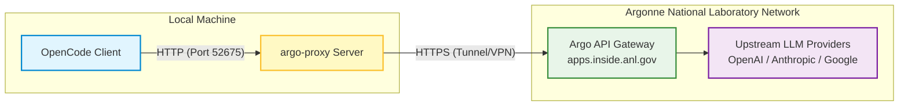

# OpenCode & ALCF Argo Service Integration Guide

## Executive Summary

This document provides a comprehensive, step-by-step technical guide to
connecting **OpenCode** to the **ALCF Argo Service** via a local `argo-proxy`
server. This configuration allows developers to safely tunnel API requests
(supporting OpenAI, Anthropic, and Google GenAI formats) through the secure
Computing, Environment, and Life Sciences (CELS) General Computing Environment
(GCE) infrastructure at Argonne National Laboratory.

By following this guide, users will:

1. Generate and configure secure SSH keys to authenticate against the CELS
   infrastructure via jump hosts.
2. Install, configure, and validate `argo-proxy` locally to manage proxy
   connections over port `52675`.
3. Configure OpenCode to interact seamlessly with the local proxy, routing
   standard AI models through the secure Argonne network.

---

## Architecture Overview

The multi-tiered connection flow runs standard OpenAI-compatible HTTP requests
locally, bridges them over the secure network via `argo-proxy`, and sends
encrypted HTTPS queries to the production Argo API.



---

## Step 1: Setting Up Your CELS Account Overview

To use the ALCF Argo Service via OpenCode, you need SSH access to the GCE
(General Computing Environment) infrastructure managed by CELS (Computing,
Environment, and Life Sciences) at Argonne National Laboratory. This guide walks
you through generating SSH keys, registering them, and configuring your SSH
client.

### Prerequisites

- You must have an Argonne username.
- You must have requested access to the GCE project before proceeding.
- These instructions assume you are using **OpenSSH** (available on Linux,
  macOS, and Windows via WSL or the built-in SSH client).

### 1. Generate an SSH Key Pair

Generate an Ed25519 key pair (the preferred and most secure algorithm):

```bash
ssh-keygen -a 100 -t ed25519

```

You will be prompted for:

- **File location** — Press `Enter` to accept the default (`~/.ssh/id_ed25519`),
  or specify a custom name. If you choose a custom name, you will need to
  reference it in your SSH config later.
- **Passphrase** — A strong passphrase is required by CELS policy. Enter it
  twice to confirm.

After completion, two files are created:

| File Path               | Purpose                                                                                   |
| ----------------------- | ----------------------------------------------------------------------------------------- |
| `~/.ssh/id_ed25519`     | **Private key** — Keep this secure. Never share it or store it on NFS shared filesystems. |
| `~/.ssh/id_ed25519.pub` | **Public key** — This is what you upload to your CELS account.                            |

### 2. Register Your Public Key

1. Copy the contents of your public key file (`~/.ssh/id_ed25519.pub`).
2. Log in to [https://accounts.cels.anl.gov](https://accounts.cels.anl.gov).
3. On the **Account Information** page, click **Add Key** at the bottom.
4. Paste the public key into the **Key** field.
5. Optionally, add a **Description** (e.g., `"Laptop - 2025"`) for your own
   reference.

### 3. Verify SSH Access

Before configuring anything else, verify that you can connect using the jump
host:

```bash
ssh -J <your-argonne-username>@logins.cels.anl.gov <your-argonne-username>@homes.cels.anl.gov

```

> ⚠️ **Important:** Replace `<your-argonne-username>` with your actual Argonne
> username. Do not copy and paste the command verbatim.

If this command succeeds and you get a shell on `homes.cels.anl.gov`, proceed to
configuring your SSH config file for convenience.

> ℹ️ **Note:** You cannot get a shell on the GCE login nodes
> (`logins.cels.anl.gov`). They serve only as jump/proxy hosts.

### 4. Configure Your SSH Config File

Setting up your `~/.ssh/config` allows you to connect with short, memorable
commands and is required for tools like OpenCode to tunnel connections properly.

#### 4.1 Create the Control Channels Directory

SSH multiplexing uses control sockets to reuse connections. Create the directory
for them:

```bash
mkdir -p ~/.ssh/.control_channels

```

#### 4.2 Edit `~/.ssh/config`

Add the following entries to `~/.ssh/config` (create the file if it doesn't
exist). Replace the `User` and `IdentityFile` values with your own:

```text
Host login-gce
    User <your-argonne-username>
    IdentityFile ~/.ssh/id_ed25519
    Hostname logins.cels.anl.gov
    ControlMaster auto
    ControlPersist yes
    LogLevel ERROR
    ControlPath ~/.ssh/.control_channels/%h:%p:%r

Host homes-gce
    User <your-argonne-username>
    IdentityFile ~/.ssh/id_ed25519
    Hostname homes.cels.anl.gov
    ProxyJump login-gce
    ForwardX11Trusted yes
    ControlPath ~/.ssh/.control_channels/%h:%p:%r

```

##### Directive Explanations:

| Directive               | Purpose                                                                                                                |
| ----------------------- | ---------------------------------------------------------------------------------------------------------------------- |
| `User`                  | Your Argonne username (required if it differs from your local username).                                               |
| `IdentityFile`          | Path to your private SSH key.                                                                                          |
| `Hostname`              | The fully qualified domain name of the target host.                                                                    |
| `ProxyJump login-gce`   | Routes the connection through the `login-gce` jump host, since GCE resources are not directly accessible from offsite. |
| `ControlMaster auto`    | Enables SSH connection multiplexing; the first connection becomes the master.                                          |
| `ControlPersist yes`    | Keeps the master connection alive in the background after the session ends.                                            |
| `ControlPath`           | Path to the Unix socket used for multiplexed connections.                                                              |
| `ForwardX11Trusted yes` | Enables trusted X11 forwarding for GUI applications.                                                                   |
| `LogLevel ERROR`        | Suppresses verbose log output on the jump host connection.                                                             |

#### 4.3 (Optional) Wildcard Entry

If you need to access multiple `*.cels.anl.gov` hosts (e.g., a CELS-managed
workstation), you can add a wildcard entry instead of individual host blocks:

```text
Host *.cels.anl.gov !logins.cels.anl.gov
    ProxyJump login-gce
    ForwardX11Trusted yes

```

This routes all SSH connections to `*.cels.anl.gov` through the login jump host,
except connections to `logins.cels.anl.gov` itself (to avoid a circular proxy).

### 5. Test the Configuration

With the config in place, connect using the short alias:

```bash
ssh homes-gce

```

You should be prompted for your SSH key passphrase and then receive a shell on
`homes.cels.anl.gov`. If this works, your CELS account is properly configured
and ready for the next step.

### Example: Full SSH Config with ALCF and CELS Hosts

Below is a reference SSH config that includes both ALCF compute systems and CELS
GCE hosts. Adapt it to your own username and key paths:

```text
# --- ALCF Systems ---

Host crux
    HostName crux.alcf.anl.gov
    User <your-argonne-username>
    ControlMaster auto
    ControlPath ~/.ssh/connections/master-%r@%h:%p

Host polaris
    HostName polaris.alcf.anl.gov
    User <your-argonne-username>
    ControlMaster auto
    ControlPath ~/.ssh/connections/master-%r@%h:%p

Host sophia
    HostName sophia.alcf.anl.gov
    User <your-argonne-username>
    ControlMaster auto
    ControlPath ~/.ssh/connections/master-%r@%h:%p

# --- CELS GCE ---

Host login-gce
    User <your-argonne-username>
    IdentityFile ~/.ssh/id_ed25519
    Hostname logins.cels.anl.gov
    ControlMaster auto
    ControlPersist yes
    LogLevel ERROR
    ControlPath ~/.ssh/.control_channels/%h:%p:%r

Host homes-gce
    User <your-argonne-username>
    IdentityFile ~/.ssh/id_ed25519
    Hostname homes.cels.anl.gov
    ProxyJump login-gce
    ForwardX11Trusted yes
    ControlPath ~/.ssh/.control_channels/%h:%p:%r

```

> 🔒 **Security reminder:** Never store your private SSH key on NFS shared
> filesystems, including GCE workstation home directories. Once logged in to a
> CELS-managed machine, you can SSH between managed nodes (home nodes, compute
> nodes, workstations) without needing your private key again.

---

## Step 2: Installing and Configuring `argo-proxy`

### Overview

`argo-proxy` is a local proxy server that bridges your development tools (like
OpenCode) to the ALCF Argo API. It runs on your machine and translates standard
API requests (OpenAI, Anthropic, Google GenAI formats) into requests that the
Argo API understands. In this step, you will install `argo-proxy`, configure it
to use port `52675` and the production Argo environment, and verify that it
works.

### Prerequisites

- Python 3.10 or higher
- A completed Step 1: CELS Account Setup with working SSH access to `homes-gce`
- An active connection to the Argonne network (on-campus, VPN, or SSH tunnel)

### 1. Create an Isolated Environment

It is recommended to install `argo-proxy` in a dedicated environment to avoid
dependency conflicts. Choose one of the following methods:

#### Option A: Conda / Mamba

```bash
conda create -n argo-proxy python=3.12 -y
conda activate argo-proxy

```

#### Option B: pipx

```bash
pipx install argo-proxy

```

_If you use `pipx`, skip to Section 3 — `pipx` handles installation in one
step._

### 2. Install `argo-proxy`

With your environment activated, install the latest stable release from PyPI:

```bash
pip install argo-proxy

```

Verify the installation:

```bash
argo-proxy --version

```

This should display the installed version number and check for available
updates.

### 3. First-Time Setup

If you have never run `argo-proxy` before, you can use the interactive setup
wizard:

```bash
argo-proxy config init

```

The wizard will prompt you for:

- **Port** — Enter `52675` (or press Enter and change it later).
- **Username** — Enter your Argonne username.
- **Verbose mode** — Enter `Y` to enable detailed logging.

The wizard creates a configuration file at `~/.config/argoproxy/config.yaml`.

### 4. Configure for Production on Port 52675

After the initial setup, switch to the production environment and set the port
to `52675`.

#### 4.1 Switch to the Production Environment

```bash
argo-proxy config env prod

```

This updates `argo_base_url` in your config to the production endpoint:

| Environment | Base URL                                   |
| ----------- | ------------------------------------------ |
| **prod**    | `https://apps.inside.anl.gov/argoapi`      |
| **dev**     | `https://apps-dev.inside.anl.gov/argoapi`  |
| **test**    | `https://apps-test.inside.anl.gov/argoapi` |

#### 4.2 Edit the Configuration

Open the config file in your default editor:

```bash
argo-proxy config edit

```

Ensure your `~/.config/argoproxy/config.yaml` matches the following layout:

```yaml
# Core settings
config_version: "3"
user: <your-argonne-username>
host: 0.0.0.0
port: 52675
verbose: true
log_to_file: false

# Upstream
argo_base_url: "https://apps.inside.anl.gov/argoapi"

# Network & validation
connection_test_timeout: 5
resolve_overrides: {}

# Image processing
enable_payload_control: false
max_payload_size: 20
image_timeout: 30
concurrent_downloads: 10

# Other
max_log_history: 3
```

##### Key Settings Explained:

| Option           | Value                                 | Description                                              |
| ---------------- | ------------------------------------- | -------------------------------------------------------- |
| `user`           | `<your-argonne-username>`             | Identifies you to the Argo API.                          |
| `host`           | `0.0.0.0`                             | Binds the proxy to all network interfaces.               |
| `port`           | `52675`                               | The fixed port OpenCode will connect to.                 |
| `verbose`        | `true`                                | Enables detailed request/response logging for debugging. |
| `argo_base_url`  | `https://apps.inside.anl.gov/argoapi` | The production Argo API endpoint.                        |
| `config_version` | `'3'`                                 | Specifies the v3 config format.                          |

> ℹ️ **Note:** The native upstream URLs are automatically derived from
> `argo_base_url`:
>
> - `native_openai_base_url` $\rightarrow$
>   `https://apps.inside.anl.gov/argoapi/v1`
> - `native_anthropic_base_url` $\rightarrow$
>   `https://apps.inside.anl.gov/argoapi`

### 5. Validate the Configuration

Run the built-in validator to check syntax, required fields, and upstream
connectivity:

```bash
argo-proxy config validate

```

This verifies:

- Configuration file syntax
- Presence of all required fields
- Network connectivity to the production Argo API endpoints

You can also review the fully resolved configuration using:

```bash
argo-proxy config show

```

Expected output format:

```json
{
    "argo_base_url": "https://apps.inside.anl.gov/argoapi",
    "mode": "universal",
    "native_anthropic_base_url": "https://apps.inside.anl.gov/argoapi",
    "native_openai_base_url": "https://apps.inside.anl.gov/argoapi/v1",
    "port": 52675,
    "user": "<your-argonne-username>",
    "verbose": true
}
```

### 6. Start the Proxy Server

Launch `argo-proxy`:

```bash
argo-proxy serve

```

You should see a startup banner similar to:

```text
============================================================
🚀 ARGO PROXY v3.0.0 (Latest)
⚙️ MODE: Universal (llm-rosetta)
============================================================

```

The proxy is now running on `http://0.0.0.0:52675` and ready to accept requests
from OpenCode.

> **Tip:** You can also start the server with explicit options to override
> config values: `argo-proxy serve --port 52675 --verbose --show`

### 7. Verify Available Models

To confirm the proxy can reach the Argo API and list available models, execute:

```bash
argo-proxy models

```

This displays all available upstream models organized by family (OpenAI,
Anthropic, Google) along with their aliases.

### Troubleshooting (Step 2)

| Issue                             | Solution                                                                                                                              |
| --------------------------------- | ------------------------------------------------------------------------------------------------------------------------------------- |
| **Port 52675 already in use**     | Stop the conflicting service, or choose a different port with `--port`.                                                               |
| **Configuration not found**       | Ensure `config.yaml` exists in one of: `./config.yaml`, `~/.config/argoproxy/config.yaml`, or `~/.argoproxy/config.yaml`.             |
| **Connectivity validation fails** | Verify you are connected to the Argonne network (on-campus, VPN, or SSH tunnel). Contact CELS IT if firewall conduit setup is needed. |
| **Deprecated config warnings**    | Run `argo-proxy config migrate` to upgrade a v2 config to v3 format.                                                                  |
| **Outdated version**              | Run `argo-proxy update check` and then `argo-proxy update install` to upgrade.                                                        |

#### Keeping `argo-proxy` Updated

```bash
# Check for available updates
argo-proxy update check

# Install the latest stable version
argo-proxy update install

# Install the latest pre-release
argo-proxy update install --pre

```

---

## Step 3: Running `argo-proxy` and Configuring OpenCode

### Overview

With `argo-proxy` installed and configured (Step 2), you can now connect
OpenCode to the ALCF Argo Service. OpenCode communicates with `argo-proxy` over
a local HTTP connection, and `argo-proxy` forwards requests to the production
Argo API on the Argonne network.

### Prerequisites

- A completed Step 2 with the proxy configured on port `52675` using the
  production environment.
- OpenCode installed locally.
- An active connection to the Argonne network (on-campus, VPN, or SSH tunnel).

### 1. Start `argo-proxy`

In a dedicated terminal window, start the proxy server:

```bash
argo-proxy serve

```

Leave this terminal running. The proxy must remain active for OpenCode to
communicate with the Argo API.

> 💡 **Tip:** If you want to confirm the proxy is healthy, open a second
> terminal and run:
>
> ```bash
> curl http://localhost:52675/v1/models
>
> ```
>
> This should return a clean JSON list of available models.

### 2. Configure OpenCode

Create or edit the OpenCode configuration file at `~/.opencode/config.json` (or
`opencode.json` in your project root) with the following contents:

```json
{
    "$schema": "https://opencode.ai/config.json",
    "share": "disabled",
    "autoupdate": "notify",
    "experimental": {
        "openTelemetry": false
    },
    "provider": {
        "argo": {
            "npm": "@ai-sdk/openai-compatible",
            "name": "Argo Gateway API",
            "options": {
                "baseURL": "http://localhost:52675/v1",
                "apiKey": "<your-argonne-username>"
            },
            "models": {
                "argo:gpt-4o-2024-11-20": {
                    "name": "GPT-4o (2024-11-20)",
                    "modalities": {
                        "input": ["text", "image"],
                        "output": ["text"]
                    },
                    "limit": {
                        "context": 128000,
                        "output": 16384
                    }
                },
                "argo:gpt-o3-mini": {
                    "name": "GPT o3 Mini"
                },
                "argo:o3-mini": {
                    "name": "o3 Mini",
                    "limit": {
                        "context": 200000,
                        "output": 100000
                    }
                },
                "argo:gpt-o1": {
                    "name": "GPT o1"
                },
                "argo:o1": {
                    "name": "o1",
                    "modalities": {
                        "input": ["text", "image"],
                        "output": ["text"]
                    },
                    "limit": {
                        "context": 200000,
                        "output": 100000
                    }
                },
                "argo:gpt-o3": {
                    "name": "GPT o3"
                },
                "argo:o3": {
                    "name": "o3",
                    "modalities": {
                        "input": ["text", "image"],
                        "output": ["text"]
                    },
                    "limit": {
                        "context": 200000,
                        "output": 100000
                    }
                },
                "argo:gpt-o4-mini": {
                    "name": "GPT o4 Mini"
                },
                "argo:o4-mini": {
                    "name": "o4 Mini",
                    "modalities": {
                        "input": ["text", "image"],
                        "output": ["text"]
                    },
                    "limit": {
                        "context": 200000,
                        "output": 100000
                    }
                },
                "argo:gpt-4.1": {
                    "name": "GPT-4.1",
                    "modalities": {
                        "input": ["text", "image"],
                        "output": ["text"]
                    },
                    "limit": {
                        "context": 1047576,
                        "output": 32768
                    }
                },
                "argo:gpt-4.1-mini": {
                    "name": "GPT-4.1 Mini",
                    "modalities": {
                        "input": ["text", "image"],
                        "output": ["text"]
                    },
                    "limit": {
                        "context": 1047576,
                        "output": 32768
                    }
                },
                "argo:gpt-4.1-nano": {
                    "name": "GPT-4.1 Nano",
                    "modalities": {
                        "input": ["text", "image"],
                        "output": ["text"]
                    },
                    "limit": {
                        "context": 1047576,
                        "output": 32768
                    }
                },
                "argo:gpt-5": {
                    "name": "GPT-5",
                    "modalities": {
                        "input": ["text", "image"],
                        "output": ["text"]
                    },
                    "limit": {
                        "context": 400000,
                        "output": 128000
                    },
                    "variants": {
                        "none": {
                            "reasoningEffort": "none",
                            "reasoningSummary": "auto",
                            "textVerbosity": "medium"
                        },
                        "low": {
                            "reasoningEffort": "low",
                            "reasoningSummary": "auto",
                            "textVerbosity": "medium"
                        },
                        "medium": {
                            "reasoningEffort": "medium",
                            "reasoningSummary": "auto",
                            "textVerbosity": "medium"
                        },
                        "high": {
                            "reasoningEffort": "high",
                            "reasoningSummary": "detailed",
                            "textVerbosity": "medium"
                        },
                        "xhigh": {
                            "reasoningEffort": "xhigh",
                            "reasoningSummary": "detailed",
                            "textVerbosity": "medium"
                        }
                    }
                },
                "argo:gpt-5-mini": {
                    "name": "GPT-5 Mini",
                    "modalities": {
                        "input": ["text", "image"],
                        "output": ["text"]
                    },
                    "limit": {
                        "context": 400000,
                        "output": 128000
                    },
                    "variants": {
                        "none": {
                            "reasoningEffort": "none",
                            "reasoningSummary": "auto",
                            "textVerbosity": "medium"
                        },
                        "low": {
                            "reasoningEffort": "low",
                            "reasoningSummary": "auto",
                            "textVerbosity": "medium"
                        },
                        "medium": {
                            "reasoningEffort": "medium",
                            "reasoningSummary": "auto",
                            "textVerbosity": "medium"
                        },
                        "high": {
                            "reasoningEffort": "high",
                            "reasoningSummary": "detailed",
                            "textVerbosity": "medium"
                        },
                        "xhigh": {
                            "reasoningEffort": "xhigh",
                            "reasoningSummary": "detailed",
                            "textVerbosity": "medium"
                        }
                    }
                },
                "argo:gpt-5-nano": {
                    "name": "GPT-5 Nano",
                    "modalities": {
                        "input": ["text", "image"],
                        "output": ["text"]
                    },
                    "limit": {
                        "context": 400000,
                        "output": 128000
                    },
                    "variants": {
                        "none": {
                            "reasoningEffort": "none",
                            "reasoningSummary": "auto",
                            "textVerbosity": "medium"
                        },
                        "low": {
                            "reasoningEffort": "low",
                            "reasoningSummary": "auto",
                            "textVerbosity": "medium"
                        },
                        "medium": {
                            "reasoningEffort": "medium",
                            "reasoningSummary": "auto",
                            "textVerbosity": "medium"
                        },
                        "high": {
                            "reasoningEffort": "high",
                            "reasoningSummary": "detailed",
                            "textVerbosity": "medium"
                        },
                        "xhigh": {
                            "reasoningEffort": "xhigh",
                            "reasoningSummary": "detailed",
                            "textVerbosity": "medium"
                        }
                    }
                },
                "argo:gpt-5.1": {
                    "name": "GPT-5.1",
                    "modalities": {
                        "input": ["text", "image"],
                        "output": ["text"]
                    },
                    "limit": {
                        "context": 400000,
                        "output": 128000
                    },
                    "variants": {
                        "none": {
                            "reasoningEffort": "none",
                            "reasoningSummary": "auto",
                            "textVerbosity": "medium"
                        },
                        "low": {
                            "reasoningEffort": "low",
                            "reasoningSummary": "auto",
                            "textVerbosity": "medium"
                        },
                        "medium": {
                            "reasoningEffort": "medium",
                            "reasoningSummary": "auto",
                            "textVerbosity": "medium"
                        },
                        "high": {
                            "reasoningEffort": "high",
                            "reasoningSummary": "detailed",
                            "textVerbosity": "medium"
                        },
                        "xhigh": {
                            "reasoningEffort": "xhigh",
                            "reasoningSummary": "detailed",
                            "textVerbosity": "medium"
                        }
                    }
                },
                "argo:gpt-5-2": {
                    "name": "GPT-5.2",
                    "modalities": {
                        "input": ["text", "image"],
                        "output": ["text"]
                    },
                    "limit": {
                        "context": 400000,
                        "output": 128000
                    },
                    "variants": {
                        "none": {
                            "reasoningEffort": "none",
                            "reasoningSummary": "auto",
                            "textVerbosity": "medium"
                        },
                        "low": {
                            "reasoningEffort": "low",
                            "reasoningSummary": "auto",
                            "textVerbosity": "medium"
                        },
                        "medium": {
                            "reasoningEffort": "medium",
                            "reasoningSummary": "auto",
                            "textVerbosity": "medium"
                        },
                        "high": {
                            "reasoningEffort": "high",
                            "reasoningSummary": "detailed",
                            "textVerbosity": "medium"
                        },
                        "xhigh": {
                            "reasoningEffort": "xhigh",
                            "reasoningSummary": "detailed",
                            "textVerbosity": "medium"
                        }
                    }
                },
                "argo:gpt-5.4": {
                    "name": "GPT-5.4",
                    "modalities": {
                        "input": ["text", "image"],
                        "output": ["text"]
                    },
                    "limit": {
                        "context": 1000000,
                        "output": 128000
                    },
                    "variants": {
                        "none": {
                            "reasoningEffort": "none",
                            "reasoningSummary": "auto",
                            "textVerbosity": "medium"
                        },
                        "low": {
                            "reasoningEffort": "low",
                            "reasoningSummary": "auto",
                            "textVerbosity": "medium"
                        },
                        "medium": {
                            "reasoningEffort": "medium",
                            "reasoningSummary": "auto",
                            "textVerbosity": "medium"
                        },
                        "high": {
                            "reasoningEffort": "high",
                            "reasoningSummary": "detailed",
                            "textVerbosity": "medium"
                        },
                        "xhigh": {
                            "reasoningEffort": "xhigh",
                            "reasoningSummary": "detailed",
                            "textVerbosity": "medium"
                        }
                    }
                },
                "argo:gpt-5.5": {
                    "name": "GPT-5.5",
                    "modalities": {
                        "input": ["text", "image"],
                        "output": ["text"]
                    },
                    "limit": {
                        "context": 1000000,
                        "output": 128000
                    },
                    "variants": {
                        "none": {
                            "reasoningEffort": "none",
                            "reasoningSummary": "auto",
                            "textVerbosity": "medium"
                        },
                        "low": {
                            "reasoningEffort": "low",
                            "reasoningSummary": "auto",
                            "textVerbosity": "medium"
                        },
                        "medium": {
                            "reasoningEffort": "medium",
                            "reasoningSummary": "auto",
                            "textVerbosity": "medium"
                        },
                        "high": {
                            "reasoningEffort": "high",
                            "reasoningSummary": "detailed",
                            "textVerbosity": "medium"
                        },
                        "xhigh": {
                            "reasoningEffort": "xhigh",
                            "reasoningSummary": "detailed",
                            "textVerbosity": "medium"
                        }
                    }
                },
                "argo:gemini-2.5-pro": {
                    "name": "Gemini 2.5 Pro",
                    "modalities": {
                        "input": ["text", "image"],
                        "output": ["text"]
                    },
                    "limit": {
                        "context": 1048576,
                        "output": 65536
                    }
                },
                "argo:gemini-2.5-flash": {
                    "name": "Gemini 2.5 Flash",
                    "modalities": {
                        "input": ["text", "image"],
                        "output": ["text"]
                    },
                    "limit": {
                        "context": 1048576,
                        "output": 65536
                    }
                },
                "argo:claude-opus-4.7": {
                    "name": "Claude 4.7 Opus",
                    "modalities": {
                        "input": ["text", "image"],
                        "output": ["text"]
                    },
                    "limit": {
                        "context": 200000,
                        "output": 32000
                    }
                },
                "argo:claude-opus-4.6": {
                    "name": "Claude Opus 4.6",
                    "modalities": {
                        "input": ["text", "image"],
                        "output": ["text"]
                    },
                    "limit": {
                        "context": 200000,
                        "output": 32000
                    }
                },
                "argo:claude-opus-4.5": {
                    "name": "Claude Opus 4.5",
                    "modalities": {
                        "input": ["text", "image"],
                        "output": ["text"]
                    },
                    "limit": {
                        "context": 200000,
                        "output": 32000
                    }
                },
                "argo:claude-opus-4.1": {
                    "name": "Claude Opus 4.1",
                    "modalities": {
                        "input": ["text", "image"],
                        "output": ["text"]
                    },
                    "limit": {
                        "context": 200000,
                        "output": 32000
                    }
                },
                "argo:claude-haiku-4.5": {
                    "name": "Claude 4.5 Haiku",
                    "modalities": {
                        "input": ["text", "image"],
                        "output": ["text"]
                    },
                    "limit": {
                        "context": 200000,
                        "output": 8192
                    }
                },
                "argo:claude-sonnet-4.6": {
                    "name": "Claude 4.6 Sonnet",
                    "modalities": {
                        "input": ["text", "image"],
                        "output": ["text"]
                    },
                    "limit": {
                        "context": 200000,
                        "output": 64000
                    }
                },
                "argo:claude-sonnet-4.5": {
                    "name": "Claude 4.5 Sonnet",
                    "modalities": {
                        "input": ["text", "image"],
                        "output": ["text"]
                    },
                    "limit": {
                        "context": 200000,
                        "output": 64000
                    }
                }
            }
        }
    }
}
```

##### Key Configuration Details:

| Field                           | Value                       | Description                                                                                                |
| ------------------------------- | --------------------------- | ---------------------------------------------------------------------------------------------------------- |
| `provider.argo.npm`             | `@ai-sdk/openai-compatible` | The AI SDK provider package that enables OpenAI-compatible API communication.                              |
| `provider.argo.options.baseURL` | `http://localhost:52675/v1` | Points to your local `argo-proxy` instance. Must match the port configured in Step 2.                      |
| `provider.argo.options.apiKey`  | `<your-argonne-username>`   | Your Argonne username. This is passed to `argo-proxy` as the user identifier — not a secret API key.       |
| `provider.argo.models`          | `argo:*`                    | Model identifiers using the `argo:` prefix. These must match the model aliases registered in the Argo API. |

> ⚠️ **Important:** Replace `<your-argonne-username>` in the `apiKey` field with
> your actual Argonne username. This value must match the `user` field in your
> `argo-proxy` `config.yaml`.

### 3. Launch OpenCode

With `argo-proxy` running in a separate terminal, start OpenCode from your
project directory:

```bash
opencode

```

OpenCode will detect the `opencode.json` configuration and register the `argo`
provider along with all listed models. You can select any of the configured
models from the model picker within the OpenCode interface.

### 4. Verify the Connection

To confirm everything is working end-to-end:

- **Check `argo-proxy` logs** — In the terminal running `argo-proxy`, you should
  see incoming requests logged when OpenCode sends a query (since
  `verbose: true` is enabled).
- **Send a test message** — In OpenCode, select a model (e.g.,
  `GPT-4o (2024-11-20)`) and send a simple prompt. You should receive a response
  within a few seconds.
- **Check available models** — You can verify which models are available
  upstream at any time:

```bash
argo-proxy models

```

### Custom Commands

The configuration includes an optimized OpenCode custom command:

| Command | Target Agent Mode | Description                                                                                                                          |
| ------- | ----------------- | ------------------------------------------------------------------------------------------------------------------------------------ |
| `/paq`  | `plan`            | Prompts the model to analyze target code blocks, identify technical or structural limitations, and ask clarifying context questions. |

_Use it in OpenCode by typing `/paq` followed by your target code context or
question._

---

### Troubleshooting (Step 3)

| Issue                                   | Solution                                                                                                                                                                            |
| --------------------------------------- | ----------------------------------------------------------------------------------------------------------------------------------------------------------------------------------- |
| **OpenCode shows "connection refused"** | Ensure `argo-proxy serve` is fully running in a separate terminal and listening explicitly on port `52675`.                                                                         |
| **Models not appearing in OpenCode**    | Verify the model names inside `opencode.json` match the aliases returned from running `argo-proxy models`.                                                                          |
| **Responses fail or timeout**           | Confirm you are successfully connected to the active Argonne network (on-campus infrastructure or secure VPN endpoint). Check your `argo-proxy` terminal interface for error flags. |
| **"Invalid API key" errors**            | Ensure the `apiKey` string inside your `opencode.json` matches the specified `user` field in your `argo-proxy` `config.yaml`.                                                       |
| **`argo-proxy` fails to start**         | Run `argo-proxy config validate` to diagnose system-level configuration or connectivity issues.                                                                                     |
